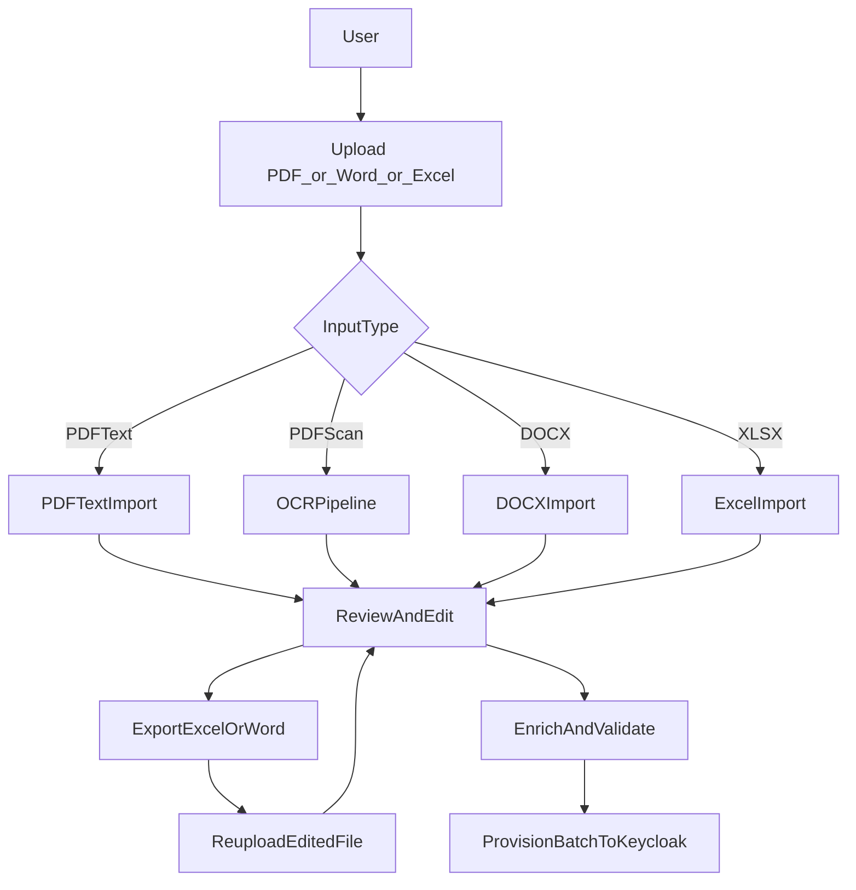
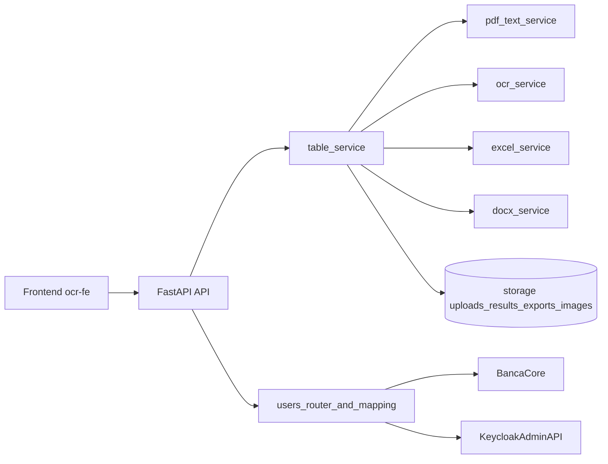

# Báo Cáo Hệ Thống OCR Banca Agribank

## 1) Executive Summary

Hệ thống `OCR Banca` là nền tảng hỗ trợ số hóa danh sách user SSO Agribank từ tài liệu đầu vào (PDF/Word/Excel), chuẩn hóa dữ liệu, kiểm tra lỗi và tạo lô người dùng lên Keycloak.  
Giá trị chính của hệ thống:

- Giảm thao tác nhập tay khi onboarding user số lượng lớn.
- Tăng độ chính xác nhờ cơ chế ưu tiên đọc text trực tiếp từ PDF số, kết hợp OCR fallback cho PDF scan.
- Hỗ trợ quy trình vận hành hoàn chỉnh: upload, OCR/review, export, chỉnh sửa offline, re-upload, enrich, provision.
- Có khả năng mở rộng chạy local CPU/GPU hoặc remote worker GPU nội bộ/Colab.

Trạng thái hiện tại:

- Đã hỗ trợ đầy đủ luồng Word/Excel trực tiếp (bỏ OCR).
- Đã bổ sung xuất Word định dạng dễ nhìn, cho phép re-upload Word đã sửa.
- Đã có bộ test unit + E2E API cho luồng PDF -> export Word -> re-upload.

---

## 2) Mục Tiêu Và Phạm Vi Hệ Thống

### 2.1 Mục tiêu nghiệp vụ

- Tự động hóa quy trình chuẩn bị dữ liệu user để tạo lô trên Keycloak.
- Chuẩn hóa dữ liệu bắt buộc: email, IPCAS, CCCD, SĐT, mã chi nhánh, vai trò.
- Rút ngắn thời gian xử lý và giảm sai sót thủ công.

### 2.2 Phạm vi chức năng hiện có

- Nhận đầu vào: `PDF`, `Word (.docx)`, `Excel (.xlsx/.xlsm)`.
- OCR + text extraction theo từng trang, theo dõi tiến độ realtime.
- Review/chỉnh sửa dữ liệu trên UI.
- Export kết quả ra `Excel` và `Word`.
- Re-upload file đã chỉnh (`Excel`/`Word`) để ghi đè dữ liệu job.
- Enrich dữ liệu chi nhánh/đại lý.
- Provision batch user lên Keycloak với xử lý conflict.

### 2.3 Ngoài phạm vi

- Không thay thế hệ thống IDM/Keycloak; chỉ đóng vai trò tiền xử lý và đồng bộ dữ liệu.
- Không xử lý tài liệu ngoài mẫu nghiệp vụ SSO đã định nghĩa.

---

## 3) Luồng Chức Năng Nghiệp Vụ

### 3.1 Luồng người dùng chuẩn

1. Người dùng upload file đầu vào.
2. Hệ thống xử lý:
   - PDF có text layer -> đọc bảng trực tiếp.
   - PDF scan -> OCR.
   - Word/Excel -> import trực tiếp.
3. Người dùng kiểm tra và sửa dữ liệu trên UI.
4. Người dùng có thể export Word/Excel để chỉnh offline.
5. Người dùng re-upload file đã chỉnh sửa.
6. Hệ thống enrich và validate.
7. Người dùng xác nhận tạo lô user Keycloak.

### 3.2 Sơ đồ luồng nghiệp vụ

### 3.3 Vai trò người dùng trong vận hành

- **Nhân sự nghiệp vụ**: upload, review, sửa dữ liệu, xác nhận tạo lô.
- **Vận hành IT**: giám sát job, health, queue, xử lý lỗi môi trường.
- **Kỹ thuật**: tối ưu OCR, nâng cấp mapping, mở rộng tích hợp.

### 3.4 Cập nhật UX mới (màn users updated)

- Ở bước cuối sau khi tạo lô, người dùng chọn thao tác cho `updated users` (`skip`, `reset_password`, `reset_otp`, `reset_both`).
- Khi **F5/reload**, hệ thống **giữ nguyên màn kết quả** và toàn bộ lựa chọn đang có.
- Người dùng chỉ quay về từ đầu khi bấm các nút điều hướng chủ động (ví dụ `Tải file khác` hoặc `Quay lại`).
- Sau khi bấm **Hoàn tất**, dropdown lựa chọn cho user updated **không bị khóa** để có thể đổi lại (undo) và thực hiện lại.

---

## 4) Kiến Trúc Và Thành Phần Kỹ Thuật

### 4.1 Kiến trúc tổng thể

- **Frontend**: `ocr-fe` (HTML/JS) phục vụ upload, theo dõi tiến độ, review, export/re-upload.
- **Backend**: `FastAPI` trong `ocr-service`.
- **OCR stack**:
  - `PaddleOCR`: detect/layout/table.
  - `VietOCR`: nhận dạng text tiếng Việt.
  - `pdfplumber`: đọc text layer cho PDF số.
- **Lưu trữ runtime**: in-memory + JSON file dưới `storage`.

### 4.2 Sơ đồ kiến trúc kỹ thuật

### 4.3 Thành phần chính

- `app/routers/ocr.py`: upload, status, result, validation, export, re-ocr.
- `app/routers/users.py`: enrich, validate users, lookup, provision-batch.
- `app/services/table_service.py`: điều phối pipeline OCR end-to-end.
- `app/services/ocr_service.py`: nhận dạng bảng/cell OCR, pass-2 cho cột trọng yếu.
- `app/services/pdf_text_service.py`: đọc bảng trực tiếp từ PDF có text.
- `app/services/excel_service.py`: import/export Excel.
- `app/services/docx_service.py`: import/export Word.
- `app/services/user_mapping.py`: map table -> user + validate field.

---

## 5) Pipeline Xử Lý OCR/Text Extraction

### 5.1 Luật chọn chiến lược xử lý

- **PDF có text layer**: ưu tiên `import_from_pdf_text()` để bỏ OCR, tăng độ chính xác.
- **PDF scan/ảnh**: dùng OCR pipeline.
- **Word/Excel**: import trực tiếp bảng, confidence mặc định `1.0`.

### 5.2 Pipeline OCR cho PDF scan

1. Chuyển PDF -> ảnh trang (lazy convert theo trang).
2. Detect bảng SSO, chia lưới cell.
3. OCR cell bằng VietOCR.
4. Post-process dữ liệu bảng.
5. Pass-2 selective bằng Paddle cho cột trọng yếu:
   - IPCAS
   - CCCD
   - Email
   - SĐT
   - Mã chi nhánh
6. Lưu kết quả incremental từng trang.

### 5.3 Các cải tiến độ chính xác đã áp dụng

- Tách luồng `PDF text direct import` thay cho OCR khi có text layer.
- Heuristic xác định dòng dữ liệu SSO dựa trên `QSO*`, email domain, CCCD.
- Pass-2 Paddle cho các cột critical.
- Chuẩn hóa email (`@agribank.com.vn`) và normalize SĐT.
- Cải thiện nhận diện branch code (ưu tiên 4 chữ số như `3526`, `6900`).

---

## 6) Quản Lý Dữ Liệu, Mapping, Validation, Enrich

### 6.1 Mapping dữ liệu

- Hỗ trợ cả layout SSO 10 cột (mới) và 9 cột (cũ).
- Header mapping linh hoạt dựa trên alias đã chuẩn hóa.
- Dữ liệu sau map thành `KeycloakUserInput`.

### 6.2 Validation

- Validate theo trường bắt buộc và format:
  - CCCD 12 số.
  - SĐT bắt đầu `0`, độ dài hợp lệ.
  - Email domain `@agribank.com.vn`.
  - Role nằm trong danh mục hợp lệ.
- Trả danh sách `errors` và `warnings` theo cell.

### 6.3 Enrich

- Enrich tự động chi nhánh/đại lý qua Banca Core.
- Hỗ trợ lookup agency/agent thủ công qua API.
- Hỗ trợ enrich lại sau khi chỉnh sửa dữ liệu.

### 6.4 Provision lên Keycloak

- Tạo mới user hoặc cập nhật user đã tồn tại.
- Gán role client, cập nhật attributes.
- Hỗ trợ conflict strategy: `skip`, `reset_password`, `reset_otp`, `reset_both`.

---

## 7) Hiệu Năng, Độ Chính Xác Và Kết Quả Test

### 7.1 Chiến lược hiệu năng

- Queue job FIFO, xử lý ổn định nhiều user đồng thời.
- Lazy convert PDF để giảm độ trễ trang đầu.
- Pipeline overlap Poppler/OCR trong local mode.
- Cho phép chọn local CPU/GPU, remote GPU nội bộ hoặc Colab.

### 7.2 Kết quả kiểm thử gần nhất

- Unit tests trọng yếu đã chạy pass:
  - `test_docx_export.py`
  - `test_pdf_text_import.py`
  - `test_docx_import.py`
- E2E script:
  - `scripts/test_e2e_pdf_word.py`: PASS.
  - `scripts/test_api_pdf_word.py`: PASS.

### 7.3 Kết quả mẫu E2E API (gần nhất)

- Upload PDF mẫu -> xử lý hoàn tất `3 trang`.
- Trích xuất ~`13` dòng user, `13` IPCAS dạng `QSO*`.
- Export Word thành công (~37 KB).
- Re-upload Word đã xuất thành công.

Lưu ý: số lỗi validation còn phụ thuộc chất lượng tài liệu đầu vào và mức độ chuẩn dữ liệu gốc.

---

## 8) Hướng Dẫn Vận Hành/Triển Khai Nhanh

### 8.1 Khởi động nhanh

- Script chính: `ocr-release-kit/Start-OcrSystem.ps1`
- Tùy chọn:
  - `-UseGpu:$false` để chạy CPU.
  - `-Port <port>` để đổi cổng.

### 8.2 Những gì script vận hành thực hiện

- Dừng process cũ trên cổng.
- Cập nhật `.env` một số biến runtime quan trọng.
- Start `uvicorn` backend.
- Poll health trong tối đa 90s.
- In URL frontend/docs + LAN/Tailscale (nếu có).

### 8.3 Chỉ số cần giám sát

- `GET /health`: trạng thái tổng thể, GPU, queue.
- `GET /api/ocr/queue`: độ sâu hàng đợi.
- `GET /api/ocr/status/{job_id}`: tiến trình từng job.

---

## 9) Hạn Chế, Backlog Cải Tiến, Lộ Trình Đề Xuất

### 9.1 Hạn chế hiện tại

- PDF scan chất lượng thấp vẫn phụ thuộc mạnh vào OCR engine.
- Trên Windows, pipeline GPU/CPU hybrid có thể không tối ưu GPU utilization tuyệt đối.
- Một số trường hợp OCR noise vẫn cần người dùng review thủ công.

### 9.2 Backlog ưu tiên ngắn hạn (1-2 sprint)

- Bổ sung dashboard thống kê chất lượng OCR theo file/template.
- Thêm mẫu benchmark tự động cho nhiều loại PDF scan khác nhau.
- Cải thiện thông điệp lỗi/prompt sửa lỗi trên UI theo từng field cụ thể.

### 9.3 Lộ trình trung hạn

- Tách worker queue sang Redis/Celery để scale ngang.
- Lưu metadata/job history trên DB thay vì in-memory + JSON file.
- Tăng tự động hóa kiểm thử regression OCR theo bộ dataset chuẩn.

---

## 10) Phụ Lục API Và Checklist UAT

### 10.1 API OCR chính

- `POST /api/ocr/upload`
- `POST /api/ocr/upload-excel`
- `POST /api/ocr/upload-docx`
- `GET /api/ocr/status/{job_id}`
- `GET /api/ocr/result/{job_id}`
- `PUT /api/ocr/result/{job_id}`
- `GET /api/ocr/result/{job_id}/validation`
- `GET /api/ocr/result/{job_id}/export`
- `GET /api/ocr/result/{job_id}/export-docx`
- `GET /api/ocr/result/{job_id}/pdf-to-docx`
- `POST /api/ocr/result/{job_id}/page/{page_number}/reocr`

### 10.2 API Users/Provision

- `GET /api/users/field-config`
- `POST /api/users/validate`
- `POST /api/users/enrich`
- `GET /api/users/lookup/agencies`
- `GET /api/users/lookup/agents`
- `GET /api/users/preview-from-job/{job_id}`
- `POST /api/users/provision-batch`

### 10.3 Checklist UAT đề xuất

- Upload PDF số có text -> hệ thống bỏ OCR và trích xuất đúng user.
- Upload PDF scan -> OCR chạy đầy đủ, có thể review/edit.
- Export Word/Excel sau OCR -> mở file và kiểm tra định dạng.
- Re-upload Word/Excel đã sửa -> dữ liệu được cập nhật đúng job.
- Validate báo lỗi đúng cột sai (email/CCCD/SĐT/role).
- Enrich trả dữ liệu chi nhánh/đại lý hợp lệ.
- Provision-batch tạo/cập nhật user đúng chiến lược conflict.
- Ở màn kết quả batch:
  - Chọn action cho updated users.
  - F5/reload web vẫn giữ đúng màn và lựa chọn.
  - Bấm Hoàn tất xong vẫn đổi lại action được và chạy lại được.

### 10.4 Bộ tiêu đề đề xuất để chụp màn hình hướng dẫn

Sử dụng các tiêu đề dưới đây khi làm tài liệu hướng dẫn người dùng (SOP screenshot):

1. `Bước 1 - Tải dữ liệu PDF/Word/Excel`
2. `Bước 2 - Chọn chế độ xử lý (Local/GPU nội bộ/Colab/API)`
3. `Bước 3 - Theo dõi tiến độ OCR theo từng trang`
4. `Bước 4 - Tải Excel/Word trong khi OCR đang chạy`
5. `Bước 5 - OCR hoàn tất và tải file chỉnh sửa`
6. `Bước 6 - Upload lại Excel/Word đã sửa`
7. `Bước 7 - Kiểm tra dữ liệu và sửa lỗi bắt buộc`
8. `Bước 8 - Enrich lại thông tin chi nhánh/đại lý`
9. `Bước 9 - Xác nhận tạo lô user`
10. `Bước 10 - Màn kết quả tạo lô (created/updated/failed)`
11. `Bước 11 - Chọn thao tác cho updated users`
12. `Bước 12 - Hoàn tất và undo lựa chọn khi cần`
13. `Bước 13 - Reload trình duyệt và khôi phục trạng thái màn kết quả`

---

## 11) Khung Báo Cáo Theo Mẫu Ngân Hàng (Tham Khảo)

Phần này bổ sung theo thông lệ báo cáo hệ thống công nghệ trong tổ chức tài chính: tập trung vào quản trị rủi ro công nghệ, khả dụng dịch vụ, kiểm soát truy cập, an toàn dữ liệu, DR/BCP, và bằng chứng kiểm thử.

### 11.1 Cấu trúc báo cáo ngân hàng thường dùng

1. Bối cảnh nghiệp vụ và phạm vi hệ thống.
2. Kiến trúc và dữ liệu (logical + deployment view).
3. Kiểm soát bảo mật theo lớp (identity, network, app, data, ops).
4. Quản trị rủi ro và phân loại mức độ quan trọng hệ thống.
5. Tính sẵn sàng dịch vụ và mục tiêu SLA/SLO.
6. Khả năng phục hồi (backup, DR, RTO, RPO, diễn tập).
7. Quản lý thay đổi và SDLC.
8. Kết quả test, phát hiện, kế hoạch khắc phục.
9. Phụ lục bằng chứng (log, ticket, checklist, biên bản test).

### 11.2 Đề xuất chuẩn hóa cho hệ thống OCR Banca

- Chuẩn hóa mỗi kỳ báo cáo theo chu kỳ tháng/quý.
- Tách phần "Executive" và "Technical Evidence" để phục vụ 2 nhóm độc giả.
- Mỗi mục kiểm soát phải có:
  - chủ sở hữu (owner),
  - trạng thái tuân thủ,
  - bằng chứng,
  - thời hạn khắc phục.

---

## 12) Ma Trận Kiểm Soát Kỹ Thuật (Control Matrix)

### 12.1 Control matrix đề xuất

| Nhóm kiểm soát | Mục tiêu | Hiện trạng OCR Banca | Mức độ |
|---|---|---|---|
| IAM/API access | Chỉ client hợp lệ gọi API | Có `verify_worker_token` cho router OCR/Users | Tốt |
| Input validation | Ngăn dữ liệu lỗi/độc hại | Kiểm tra extension, size, field validate | Tốt |
| Data integrity | Tránh sai lệch dữ liệu đầu ra | Mapping + validate + review thủ công + reupload | Tốt |
| Auditability | Truy vết xử lý | Có `job logs`, `status`, `result` persisted JSON | Trung bình |
| Encryption in transit | Bảo mật truyền dữ liệu | Cần phụ thuộc reverse proxy/TLS triển khai ngoài | Cần bổ sung |
| Secrets management | Quản lý secret an toàn | Hiện ở `.env`; cần vault cho production | Cần bổ sung |
| Backup/DR | Khôi phục sau sự cố | Chưa tách chiến lược DR chính thức | Cần bổ sung |
| Segregation of duties | Tách quyền vận hành/phê duyệt | Chưa formal hóa trong app layer | Cần bổ sung |

### 12.2 Gap quan trọng cần đóng

- Thiếu chính sách quản lý bí mật (secret vault, rotation).
- Chưa có bộ chỉ số SLA/SLO chính thức.
- Chưa có playbook DR/BCP ở mức tài liệu phê duyệt chính thức.

---

## 13) SLA/SLO, Năng Lực Vận Hành Và DR

### 13.1 SLA/SLO đề xuất cho hệ thống OCR Banca

| Chỉ số | Mục tiêu đề xuất | Cách đo |
|---|---|---|
| Uptime API OCR | >= 99.5% | Health-check + probe định kỳ |
| OCR success rate | >= 98% job không fail hệ thống | Từ `JobStatus` |
| Mean processing time | P50/P95 theo loại file | Log pipeline theo job |
| Validation error rate | Xu hướng giảm theo tháng | `error_count`/tổng dòng |
| Rework rate | % file phải reupload | Thống kê upload lại theo job |

### 13.2 Tiering hệ thống theo mức quan trọng

| Thành phần | Tier đề xuất | RTO | RPO |
|---|---|---|---|
| API OCR core + queue | Tier 1 | <= 4 giờ | <= 1 giờ |
| Storage result/export | Tier 1 | <= 4 giờ | <= 1 giờ |
| Lookup/Enrich tích hợp | Tier 2 | <= 24 giờ | <= 8 giờ |
| Reporting nội bộ | Tier 3 | <= 72 giờ | <= 24 giờ |

### 13.3 Kế hoạch DR/BCP áp dụng cho OCR Banca

- **Backup dữ liệu runtime**: `storage/results`, `storage/exports`, cấu hình `.env` (không chứa plaintext secret production).
- **Kịch bản failover**:
  - Mất GPU: fallback CPU/local API mode.
  - Mất worker remote: chuyển mode local hoặc API provider.
  - Mất node backend: khởi động lại bằng script release kit + restore data.
- **Diễn tập định kỳ**:
  - tabletop: hàng quý.
  - restore test: hàng tháng.
  - full failover drill: 2 lần/năm.

---

## 14) SDLC, Quản Lý Thay Đổi Và Chất Lượng

### 14.1 SDLC áp dụng thực tế

- Phân tích yêu cầu theo lỗi nghiệp vụ thực tế (email mapping, SSO 10 cột, PDF text).
- Triển khai theo nhánh thay đổi nhỏ, có test hồi quy.
- Có script E2E xác nhận luồng business quan trọng:
  - PDF -> OCR/text import -> export Word -> reupload.

### 14.2 Bộ test hiện hành (đối chiếu mã nguồn)

- `tests/test_api.py`
- `tests/test_docx_import.py`
- `tests/test_docx_export.py`
- `tests/test_pdf_text_import.py`
- `tests/test_users.py`
- `tests/test_sso_enhance.py`
- `tests/test_email_reconcile.py`

### 14.3 Quản lý thay đổi đề xuất nâng chuẩn

- Mỗi release phải có:
  - release note (chức năng + ảnh hưởng dữ liệu),
  - test evidence,
  - rollback checklist.
- Gắn incident/error vào backlog cải tiến OCR để giảm lỗi lặp.

---

## 15) Rủi Ro Vận Hành Và Kế Hoạch Khắc Phục Theo Ưu Tiên

### 15.1 Ma trận rủi ro ngắn gọn

| Rủi ro | Tác động | Khả năng | Mức độ | Hành động ưu tiên |
|---|---|---|---|---|
| OCR sai với PDF scan chất lượng thấp | Sai dữ liệu user | Cao | Cao | Chuẩn hóa mẫu scan + tăng pass-2 + benchmark dataset |
| Lộ secret qua `.env` ở production | Rủi ro bảo mật | Trung bình | Cao | Dùng secret manager + rotate key |
| Quá tải khi nhiều job đồng thời | Tăng thời gian xử lý | Trung bình | Trung bình | Tách queue/worker, autoscale |
| Thiếu DR playbook chính thức | Gián đoạn kéo dài | Thấp-Trung bình | Trung bình | Xây DR runbook + drill định kỳ |
| Sai role mapping nghiệp vụ | Sai phân quyền | Trung bình | Cao | Bổ sung rule kiểm tra và approval step |

### 15.2 Kế hoạch 90 ngày đề xuất

**0-30 ngày**
- Chuẩn hóa dashboard vận hành (queue depth, fail rate, mean processing).
- Đóng gói policy bảo mật secret và phân quyền vận hành.
- Bổ sung checklist release/rollback chuẩn.

**31-60 ngày**
- Thiết lập baseline SLA/SLO và báo cáo tháng.
- Mở rộng bộ dữ liệu benchmark OCR theo nhiều mẫu PDF scan.
- Tăng cường cảnh báo sớm khi lỗi OCR tăng đột biến.

**61-90 ngày**
- Thiết kế kiến trúc queue bền vững (Redis/Celery hoặc tương đương).
- Hoàn chỉnh DR runbook và diễn tập full failover.
- Chuẩn hóa bộ bằng chứng tuân thủ phục vụ kiểm toán nội bộ.

---

## Kết Luận

Phiên bản cập nhật này đã mở rộng báo cáo theo phong cách thường dùng trong ngân hàng: không chỉ mô tả chức năng mà còn đi sâu vào quản trị rủi ro công nghệ, kiểm soát bảo mật, vận hành dịch vụ, DR/BCP, SLA/SLO và lộ trình khắc phục có ưu tiên.  

Đối với hệ thống OCR Banca, lợi thế cốt lõi vẫn là chiến lược kết hợp `PDF text direct import` + `OCR fallback`, đồng thời cần nâng chuẩn vận hành theo hướng "có thể kiểm toán được" để đáp ứng yêu cầu quản trị công nghệ ở cấp tổ chức tài chính.

## Tài Liệu Tham Khảo Bố Cục Báo Cáo

- [MAS Technology Risk Management Guidelines](https://www.mas.gov.sg/-/media/MAS/Regulations-and-Financial-Stability/Regulatory-and-Supervisory-Framework/Risk-Management/TRM-Guidelines-18-January-2021.pdf?la=en)
- [Business Impact Analysis guidance (RTO/RPO focus)](https://www.metricstream.com/learn/business-impact-analysis.html)
- [Thông tư 09/2020/TT-NHNN về an toàn hệ thống thông tin trong hoạt động ngân hàng](https://thuvienphapluat.vn/van-ban/Tien-te-Ngan-hang/Thong-tu-09-2020-TT-NHNN-an-toan-he-thong-thong-tin-trong-hoat-dong-ngan-hang-455885.aspx)
