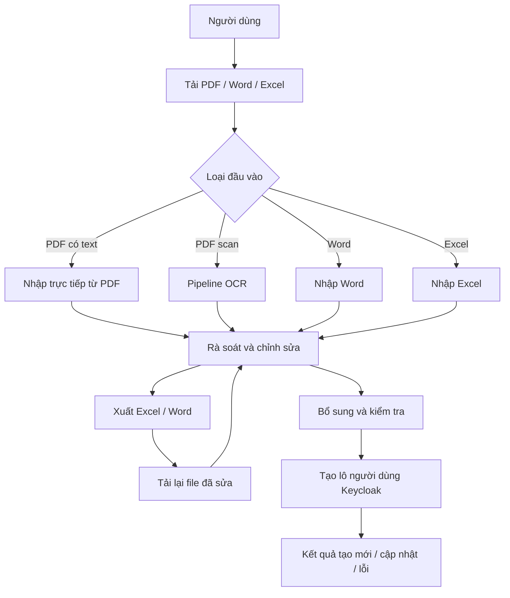
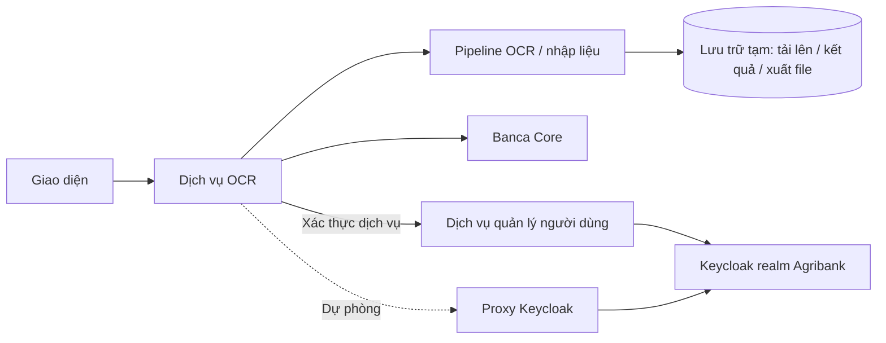

# BÁO CÁO HỆ THỐNG OCR BANCA AGRIBANK

## 1. Tóm tắt

Hệ thống OCR Banca hỗ trợ số hóa danh sách người dùng SSO Agribank từ tài liệu đầu vào (PDF, Word, Excel), chuẩn hóa và kiểm tra dữ liệu, sau đó tạo lô người dùng trên Keycloak.

Hệ thống giúp:

- Giảm thao tác nhập tay khi onboarding số lượng lớn người dùng.
- Tăng độ chính xác nhờ ưu tiên đọc text trực tiếp từ PDF số, kết hợp OCR cho PDF scan.
- Bao phủ đầy đủ quy trình vận hành: tải file, xử lý, rà soát, xuất file, chỉnh sửa offline, tải lại, bổ sung dữ liệu chi nhánh/đại lý và tạo lô người dùng.
- Linh hoạt về hạ tầng xử lý: máy chủ CPU/GPU, worker GPU nội bộ hoặc Google Colab.
- Tách lớp quản lý người dùng Keycloak thành dịch vụ riêng, bảo đảm gọi Admin API an toàn trong mạng nội bộ, không phụ thuộc đường đi bị F5/WAF chặn.

---

## 2. Mục tiêu và phạm vi

### 2.1. Mục tiêu nghiệp vụ

- Tự động hóa chuẩn bị dữ liệu người dùng trước khi tạo lô trên Keycloak.
- Chuẩn hóa các trường bắt buộc: email, IPCAS, CCCD, số điện thoại, mã chi nhánh, vai trò.
- Rút ngắn thời gian xử lý và giảm sai sót thủ công.

### 2.2. Phạm vi chức năng

- Nhận đầu vào: PDF, Word (.docx), Excel (.xlsx/.xlsm).
- Trích xuất dữ liệu theo trang, theo dõi tiến độ theo thời gian thực.
- Rà soát và chỉnh sửa trên giao diện.
- Xuất kết quả ra Excel/Word; hỗ trợ chuyển PDF gốc sang Word.
- Tải lại file đã chỉnh để cập nhật dữ liệu.
- Bổ sung thông tin chi nhánh/đại lý từ hệ thống Banca Core.
- Tạo lô người dùng Keycloak, xử lý xung đột (tạo mới / cập nhật / đặt lại mật khẩu hoặc OTP).
- Cho phép chọn môi trường Keycloak DEV hoặc PROD trên giao diện.
- Hỗ trợ nhiều chế độ xử lý: Local CPU/GPU, GPU nội bộ, Colab, tự động, API cloud.

### 2.3. Ngoài phạm vi

- Không thay thế hệ thống IDM/Keycloak; chỉ đóng vai trò tiền xử lý và đồng bộ dữ liệu.
- Không xử lý tài liệu ngoài mẫu nghiệp vụ SSO đã định nghĩa.

---

## 3. Luồng nghiệp vụ

### 3.1. Quy trình chuẩn

1. Người dùng chọn môi trường Keycloak (DEV/PROD) nếu cần.
2. Tải file và chọn chế độ xử lý.
3. Hệ thống xử lý theo loại đầu vào:
   - PDF có lớp text: đọc bảng trực tiếp.
   - PDF scan: chạy OCR.
   - Word/Excel: nhập bảng trực tiếp.
4. Người dùng rà soát, chỉnh sửa trên giao diện; có thể xuất Excel/Word để chỉnh offline rồi tải lại.
5. Hệ thống bổ sung và kiểm tra dữ liệu.
6. Người dùng xác nhận tạo lô trên Keycloak.
7. Màn hình kết quả cho phép chọn thao tác với người dùng đã tồn tại (bỏ qua, đặt lại mật khẩu, đặt lại OTP, hoặc cả hai). Trạng thái màn hình được giữ khi tải lại trang; chỉ quay về bước đầu khi người dùng chủ động chọn thao tác tương ứng.

### 3.2. Sơ đồ luồng


```mermaid
flowchart TD
    A[Người dùng] --> B[Tải PDF / Word / Excel]
    B --> C{Loại đầu vào}
    C -->|PDF có text| D[Nhập trực tiếp từ PDF]
    C -->|PDF scan| E[Pipeline OCR]
    C -->|Word| F[Nhập Word]
    C -->|Excel| G[Nhập Excel]
    D --> H[Rà soát và chỉnh sửa]
    E --> H
    F --> H
    G --> H
    H --> I[Xuất Excel / Word]
    I --> J[Tải lại file đã sửa]
    J --> H
    H --> K[Bổ sung và kiểm tra]
    K --> L[Tạo lô người dùng Keycloak]
    L --> M[Kết quả tạo mới / cập nhật / lỗi]
```

### 3.3. Vai trò vận hành

| Vai trò | Trách nhiệm |
|---|---|
| Nhân sự nghiệp vụ | Tải file, rà soát, sửa dữ liệu, xác nhận tạo lô |
| Vận hành CNTT | Giám sát dịch vụ, hàng đợi, sức khỏe hệ thống, xử lý sự cố môi trường |
| Kỹ thuật | Tối ưu OCR, mở rộng tích hợp và hạ tầng |

---

## 4. Kiến trúc hệ thống

### 4.1. Thành phần chính

| Thành phần | Vai trò |
|---|---|
| Giao diện người dùng | Tải file, theo dõi tiến độ, rà soát, xuất/tải lại, tạo lô |
| Dịch vụ OCR | Điều phối OCR/nhập liệu, kiểm tra, bổ sung dữ liệu, gọi tạo lô |
| Dịch vụ quản lý người dùng | CRUD người dùng Keycloak, vai trò, mật khẩu, OTP |
| Proxy Keycloak (dự phòng) | Chuyển tiếp Admin API khi cần, tránh đường đi bị F5/WAF chặn |
| Bộ công cụ vận hành | Script khởi động, tunnel, triển khai trên máy chủ |
| Worker GPU từ xa | Xử lý OCR trên GPU nội bộ hoặc Google Colab |

### 4.2. Sơ đồ kiến trúc


```mermaid
flowchart LR
    FE[Giao diện] --> OCR[Dịch vụ OCR]
    OCR --> PIPE[Pipeline OCR / nhập liệu]
    OCR --> CORE[Banca Core]
    OCR -->|Xác thực dịch vụ| US[Dịch vụ quản lý người dùng]
    OCR -.->|Dự phòng| KP[Proxy Keycloak]
    US --> KC[Keycloak realm Agribank]
    KP --> KC
    PIPE --> ST[(Lưu trữ tạm: tải lên / kết quả / xuất file)]
```

### 4.3. Công nghệ xử lý tài liệu

- PaddleOCR: phát hiện bố cục và bảng.
- VietOCR: nhận dạng chữ tiếng Việt.
- Đọc text layer PDF khi tài liệu là PDF số (không cần OCR).
- Kết quả và tệp trung gian lưu theo phiên xử lý trên hệ thống tệp; siêu dữ liệu phiên xử lý lưu trong bộ nhớ dịch vụ.

### 4.4. Chế độ xử lý

| Chế độ | Mô tả |
|---|---|
| Local CPU/GPU | Xử lý trên máy chủ OCR |
| GPU nội bộ | Ủy thác sang worker GPU trong mạng nội bộ |
| Google Colab | Ủy thác sang notebook GPU qua đường tunnel |
| Tự động | Hệ thống chọn phương án phù hợp |
| API cloud | Sử dụng nhà cung cấp OCR bên ngoài khi cần |

---

## 5. Pipeline xử lý dữ liệu

### 5.1. Chiến lược xử lý theo loại file

- PDF có text: nhập bảng trực tiếp để tăng độ chính xác và tốc độ.
- PDF scan: chạy OCR đầy đủ.
- Word/Excel: nhập bảng trực tiếp, độ tin cậy mặc định cao.

### 5.2. Các bước OCR với PDF scan

1. Chuyển PDF thành ảnh trang (chuyển dần theo nhu cầu để giảm độ trễ trang đầu).
2. Phát hiện bảng SSO và chia ô.
3. Nhận dạng nội dung từng ô.
4. Hậu xử lý bảng.
5. Nhận dạng bổ sung tập trung vào các cột quan trọng: IPCAS, CCCD, email, số điện thoại, mã chi nhánh.
6. Lưu kết quả theo từng trang.

### 5.3. Biện pháp nâng cao độ chính xác

- Ưu tiên đọc PDF số thay vì OCR khi có thể.
- Nhận diện dòng dữ liệu SSO theo mẫu IPCAS, domain email, CCCD.
- Chuẩn hóa email về domain Agribank và chuẩn hóa số điện thoại.
- Nhận diện mã chi nhánh theo quy tắc nghiệp vụ.
- Đối soát email với IPCAS khi cần.

---

## 6. Mapping, kiểm tra, bổ sung dữ liệu và tạo lô

### 6.1. Mapping

- Hỗ trợ bố cục bảng SSO 9 cột và 10 cột.
- Ánh xạ tiêu đề linh hoạt theo tên cột đã chuẩn hóa.
- Chuyển dữ liệu bảng thành cấu trúc đầu vào tạo người dùng Keycloak.

### 6.2. Kiểm tra dữ liệu

- CCCD đủ 12 chữ số.
- Số điện thoại bắt đầu bằng 0, độ dài hợp lệ.
- Email thuộc domain `@agribank.com.vn`.
- Vai trò thuộc danh mục cho phép.
- Hệ thống trả lỗi và cảnh báo theo từng ô để người dùng sửa.

### 6.3. Bổ sung dữ liệu

- Tự động khớp chi nhánh/đại lý qua Banca Core.
- Cho phép tra cứu thủ công trên giao diện.
- Cho phép chạy lại sau khi người dùng chỉnh sửa.

### 6.4. Tạo lô người dùng

Luồng chính:

```
Giao diện → Dịch vụ OCR → Dịch vụ quản lý người dùng → Keycloak
```

Hành vi chính:

- Tạo mới hoặc cập nhật người dùng đã tồn tại.
- Gán/gỡ vai trò, cập nhật thuộc tính, mật khẩu, OTP và các hành động bắt buộc.
- Với người dùng đã cập nhật, hỗ trợ các chiến lược: bỏ qua, đặt lại mật khẩu, đặt lại OTP, hoặc cả hai.
- Khi dịch vụ quản lý người dùng chưa sẵn sàng, hệ thống báo lỗi rõ ràng và không tạo lô.

Việc chọn môi trường DEV/PROD được truyền từ giao diện xuống dịch vụ OCR theo từng phiên làm việc.

---

## 7. Triển khai và bảo mật

### 7.1. Mô hình triển khai

- Dịch vụ OCR và giao diện: chạy trên máy chủ ứng dụng hoặc host GPU nội bộ.
- Dịch vụ quản lý người dùng: triển khai trên Kubernetes, tối thiểu 2 bản sao, có kiểm tra sống/sẵn sàng.
- Proxy Keycloak: triển khai trên Kubernetes làm phương án dự phòng truy cập Admin API.
- Điểm vào dịch vụ quản lý người dùng qua cổng Istio theo tên miền nội bộ được cấp phát.
- Kết nối tới Keycloak ưu tiên qua DNS nội bộ cluster hoặc HTTPS nội bộ đã được phê duyệt.

### 7.2. Kiểm soát truy cập

| Lớp | Cơ chế |
|---|---|
| Gọi API OCR | Token chia sẻ giữa client/worker và dịch vụ |
| Gọi dịch vụ quản lý người dùng | Token dịch vụ riêng giữa OCR và user-service |
| Proxy Keycloak | Khóa proxy riêng cho đường dự phòng |
| Mạng | NetworkPolicy hạn chế nguồn vào/ra theo namespace được phép |
| Container | Chạy non-root, hạn chế quyền, hệ thống tệp chỉ đọc khi áp dụng |

### 7.3. Vận hành khởi động

Bộ công cụ vận hành hỗ trợ khởi động đồng thời dịch vụ OCR và dịch vụ quản lý người dùng, kiểm tra sức khỏe, công bố địa chỉ truy cập nội bộ/LAN khi cần, và hỗ trợ tunnel phục vụ kiểm thử từ xa.

Các chỉ số cần theo dõi thường xuyên:

- Sức khỏe dịch vụ OCR và dịch vụ quản lý người dùng.
- Độ sâu hàng đợi xử lý.
- Tiến trình từng phiên xử lý.
- Tỷ lệ tạo lô thành công / thất bại.

---

## 8. Hiệu năng và kiểm thử

### 8.1. Định hướng hiệu năng

- Hàng đợi FIFO ổn định khi nhiều người dùng cùng làm việc.
- Chuyển PDF sang ảnh theo từng trang để giảm độ trễ trang đầu.
- Cho phép chuyển chế độ CPU/GPU hoặc worker từ xa khi tài nguyên thay đổi.
- Tách tiến trình nhận dạng GPU khi cần để tránh xung đột tài nguyên.

### 8.2. Phạm vi kiểm thử

Hệ thống có bộ kiểm thử đơn vị và kiểm thử luồng cho các hạng mục chính:

- Nhập/xuất Word, nhập PDF có text.
- Ánh xạ và kiểm tra người dùng.
- Client tạo lô qua dịch vụ quản lý người dùng.
- Đối soát email, khớp chi nhánh/đại lý.
- Kiểm thử API và luồng PDF → xuất Word → tải lại.

Kết quả kiểm thử các luồng trọng yếu đạt yêu cầu đưa vào vận hành. Số lỗi kiểm tra dữ liệu trên từng hồ sơ phụ thuộc chất lượng tài liệu đầu vào.

---

## 9. Hạn chế và định hướng phát triển

### 9.1. Hạn chế

- PDF scan chất lượng thấp vẫn cần rà soát thủ công.
- Siêu dữ liệu phiên xử lý lưu trong bộ nhớ dịch vụ; khi khởi động lại có thể mất trạng thái hàng đợi (kết quả đã lưu trên đĩa vẫn còn).
- Quản lý bí mật sản xuất còn dựa trên biến môi trường và Secret Kubernetes; chưa áp dụng vault/rotation tập trung.
- Chưa có bộ chỉ số SLA/SLO và playbook DR/BCP được phê duyệt chính thức.

### 9.2. Định hướng ngắn hạn

- Chuẩn hóa cấu hình vai trò client trên mọi môi trường.
- Bổ sung bảng theo dõi chất lượng OCR và thông báo lỗi theo từng trường trên giao diện.
- Hoàn thiện gói triển khai đóng sẵn cho dịch vụ quản lý người dùng.
- Thiết lập báo cáo vận hành định kỳ (hàng đợi, tỷ lệ lỗi, thời gian xử lý).

### 9.3. Định hướng trung hạn

- Tách hàng đợi sang nền tảng bền vững (Redis/Celery hoặc tương đương) để mở rộng ngang.
- Lưu lịch sử phiên xử lý trên cơ sở dữ liệu.
- Xây dựng bộ dữ liệu chuẩn và kiểm thử hồi quy OCR tự động.
- Áp dụng quản lý bí mật tập trung và hoàn thiện DR/BCP.

---

## 10. Phụ lục API và checklist nghiệm thu

### 10.1. API dịch vụ OCR

| Nhóm | Chức năng chính |
|---|---|
| Cấu hình / giám sát | Sức khỏe hệ thống, hàng đợi, cấu hình runtime, môi trường DEV/PROD, sức khỏe worker |
| Tải dữ liệu | Tải PDF, Excel, Word |
| Theo dõi kết quả | Trạng thái phiên, kết quả, cập nhật ô, ảnh trang, OCR lại từng trang |
| Kiểm tra / xuất | Kiểm tra dữ liệu, xuất Excel, xuất Word, chuyển PDF sang Word |

### 10.2. API nghiệp vụ người dùng (qua dịch vụ OCR)

| Chức năng | Mô tả |
|---|---|
| Cấu hình trường | Trường bắt buộc, vai trò, ánh xạ tiêu đề |
| Kiểm tra / bổ sung | Validate danh sách; khớp chi nhánh/đại lý |
| Tra cứu | Tìm chi nhánh, đại lý |
| Xem trước | Xem dữ liệu người dùng từ phiên xử lý |
| Tạo lô | Tạo/cập nhật hàng loạt trên Keycloak |
| Chẩn đoán | Kiểm tra kết nối và quyền gán vai trò Keycloak |

### 10.3. API dịch vụ quản lý người dùng

Bao gồm tạo/tra cứu/cập nhật người dùng, đặt mật khẩu, thuộc tính, hành động bắt buộc, quản lý thông tin xác thực/OTP và gán/gỡ vai trò client. Mọi lời gọi đều yêu cầu xác thực dịch vụ (trừ kiểm tra sức khỏe).

### 10.4. Checklist nghiệm thu đề xuất

- PDF số: đọc trực tiếp, đúng danh sách người dùng.
- PDF scan: OCR đầy đủ, rà soát và sửa được trên giao diện.
- Các chế độ xử lý Local / GPU nội bộ / Colab hoạt động đúng cấu hình.
- Xuất và tải lại Excel/Word cập nhật đúng dữ liệu phiên.
- Kiểm tra dữ liệu báo đúng trường lỗi.
- Bổ sung chi nhánh/đại lý trả kết quả hợp lệ.
- Chuyển DEV/PROD và tạo lô đúng môi trường.
- Tạo lô qua dịch vụ quản lý người dùng thành công; khi dịch vụ dừng thì báo lỗi rõ ràng.
- Màn kết quả: chọn thao tác với người dùng đã cập nhật; tải lại trang vẫn giữ trạng thái; hoàn tất xong vẫn đổi và chạy lại được.
- Kiểm tra sức khỏe các dịch vụ đạt yêu cầu.

### 10.5. Đề xuất tiêu đề ảnh minh họa hướng dẫn vận hành

1. Tải dữ liệu PDF/Word/Excel
2. Chọn chế độ xử lý
3. Chọn môi trường Keycloak DEV/PROD
4. Theo dõi tiến độ theo trang
5. Tải file Excel/Word trong khi đang xử lý
6. Hoàn tất xử lý và tải file chỉnh sửa
7. Tải lại file đã sửa
8. Kiểm tra và sửa lỗi bắt buộc
9. Bổ sung thông tin chi nhánh/đại lý
10. Xác nhận tạo lô người dùng
11. Màn kết quả tạo mới / cập nhật / lỗi
12. Chọn thao tác với người dùng đã cập nhật
13. Hoàn tất và điều chỉnh lại thao tác khi cần
14. Tải lại trình duyệt và khôi phục màn kết quả

---

## 11. Quản trị rủi ro công nghệ và vận hành

### 11.1. Ma trận kiểm soát

| Nhóm kiểm soát | Mục tiêu | Hiện trạng | Đánh giá |
|---|---|---|---|
| Kiểm soát truy cập API | Chỉ thành phần hợp lệ được gọi | Token giữa client–OCR và OCR–dịch vụ người dùng | Đạt |
| Phân đoạn mạng | Hạn chế truy cập ngang | NetworkPolicy theo namespace và cổng được phép | Đạt |
| Bảo vệ Admin API | Không lộ đường Admin Keycloak ra ngoài không kiểm soát | Gọi qua dịch vụ nội bộ / proxy được kiểm soát | Đạt |
| Kiểm tra đầu vào | Ngăn dữ liệu sai/độc hại | Kiểm tra định dạng file và trường nghiệp vụ | Đạt |
| Toàn vẹn dữ liệu | Giảm sai lệch đầu ra | Mapping, validate, rà soát thủ công, tải lại file | Đạt |
| Củng cố container | Giảm bề mặt tấn công | Non-root, hạn chế quyền khi triển khai container | Đạt |
| Khả năng truy vết | Phục vụ kiểm toán vận hành | Nhật ký phiên xử lý và nhật ký dịch vụ | Trung bình |
| Mã hóa đường truyền | Bảo vệ dữ liệu trên đường truyền | Phụ thuộc TLS tại lớp ingress/proxy | Cần hoàn thiện chứng từ |
| Quản lý bí mật | Bảo vệ khóa và token | Secret Kubernetes / biến môi trường | Cần nâng cấp |
| Sao lưu / phục hồi | Duy trì hoạt động khi sự cố | Chưa có playbook DR chính thức | Cần bổ sung |

### 11.2. Chỉ số dịch vụ đề xuất

| Chỉ số | Mục tiêu đề xuất |
|---|---|
| Thời gian sẵn sàng dịch vụ OCR | ≥ 99,5% |
| Thời gian sẵn sàng dịch vụ quản lý người dùng | ≥ 99,5% |
| Tỷ lệ phiên OCR hoàn tất không lỗi hệ thống | ≥ 98% |
| Tỷ lệ tạo lô thành công (trừ lỗi dữ liệu đầu vào) | ≥ 99% |
| Thời gian xử lý trung bình | Theo dõi P50/P95 theo loại file |

### 11.3. Phân hạng phục hồi đề xuất

| Thành phần | Hạng | RTO | RPO |
|---|---|---|---|
| Dịch vụ OCR và hàng đợi | 1 | ≤ 4 giờ | ≤ 1 giờ |
| Dịch vụ quản lý người dùng và đường Keycloak | 1 | ≤ 4 giờ | ≤ 1 giờ |
| Kho kết quả / file xuất | 1 | ≤ 4 giờ | ≤ 1 giờ |
| Tra cứu / bổ sung Banca Core | 2 | ≤ 24 giờ | ≤ 8 giờ |
| Báo cáo nội bộ | 3 | ≤ 72 giờ | ≤ 24 giờ |

### 11.4. Phương án phục hồi

- Sao lưu thư mục kết quả, file xuất và cấu hình vận hành (không lưu bí mật dạng明文 trong bản sao lưu dùng chung).
- Mất GPU: chuyển sang CPU hoặc worker khác.
- Mất worker từ xa: chuyển về xử lý local hoặc nhà cung cấp API.
- Mất dịch vụ quản lý người dùng: khôi phục triển khai và Secret; dịch vụ OCR dừng tạo lô và báo rõ trạng thái.
- Mất máy chủ OCR: khởi động lại theo bộ công cụ vận hành và khôi phục dữ liệu đã lưu.
- Diễn tập: rà soát trên giấy hàng quý; thử khôi phục hàng tháng; diễn tập chuyển đổi toàn phần hai lần/năm.

### 11.5. Rủi ro chính và hướng xử lý

| Rủi ro | Mức độ | Hướng xử lý |
|---|---|---|
| OCR sai trên PDF scan kém chất lượng | Cao | Chuẩn hóa mẫu scan, tăng bước nhận dạng bổ sung, bộ dữ liệu chuẩn |
| Lộ bí mật cấu hình | Cao | Vault, phân quyền và xoay khóa định kỳ |
| Gián đoạn dịch vụ quản lý người dùng khi tạo lô | Cao | Duy trì tối thiểu 2 bản sao, cảnh báo sức khỏe sớm |
| Quá tải khi nhiều phiên đồng thời | Trung bình | Tách hàng đợi, mở rộng worker |
| Sai cấu hình vai trò client giữa môi trường | Cao | Chuẩn hóa cấu hình và checklist phát hành |
| Thiếu playbook DR chính thức | Trung bình | Xây dựng và diễn tập theo lịch |

### 11.6. Kế hoạch 90 ngày

**30 ngày đầu:** chuẩn hóa giám sát vận hành; hoàn thiện quy định bảo mật bí mật và phân quyền; checklist phát hành/rollback.

**30–60 ngày:** thiết lập bộ chỉ số dịch vụ và báo cáo tháng; mở rộng bộ mẫu PDF scan cho kiểm thử; cảnh báo sớm khi tỷ lệ lỗi tăng đột biến.

**60–90 ngày:** thiết kế hàng đợi bền vững; hoàn thiện runbook DR và diễn tập chuyển đổi; chuẩn hóa bộ bằng chứng phục vụ kiểm toán nội bộ.

---

## 12. Kết luận

Hệ thống OCR Banca đáp ứng nhu cầu số hóa và tạo lô người dùng SSO Agribank theo quy trình khép kín từ tải tài liệu đến đồng bộ Keycloak. Kiến trúc hiện tại kết hợp xử lý tài liệu linh hoạt với lớp quản lý người dùng tách biệt, bảo đảm kiểm soát truy cập và phù hợp môi trường mạng có F5/WAF.

Để đáp ứng yêu cầu quản trị công nghệ tại tổ chức tài chính, hệ thống cần tiếp tục nâng chuẩn về giám sát dịch vụ, quản lý bí mật, khả năng phục hồi và bằng chứng kiểm toán theo lộ trình đã đề xuất.

---

## Tài liệu tham khảo

- Thông tư 09/2020/TT-NHNN về an toàn hệ thống thông tin trong hoạt động ngân hàng
- Hướng dẫn quản trị rủi ro công nghệ thông tin (MAS Technology Risk Management Guidelines)
- Khung phân tích tác động nghiệp vụ (RTO/RPO) phục vụ xây dựng DR/BCP
